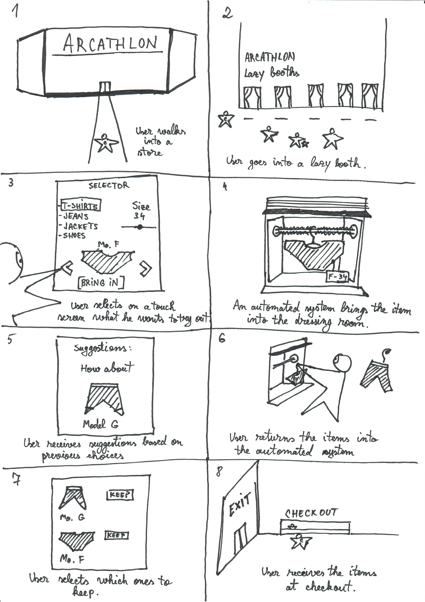
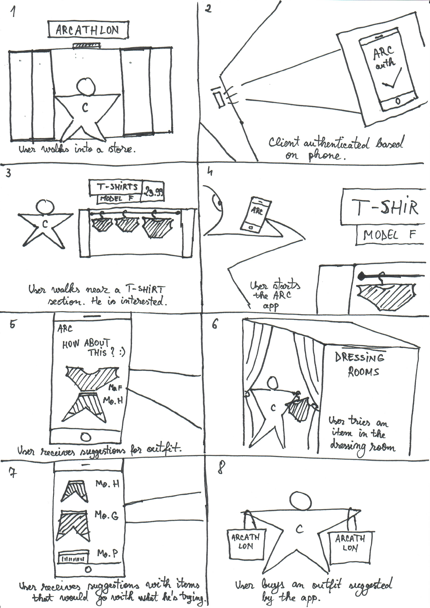
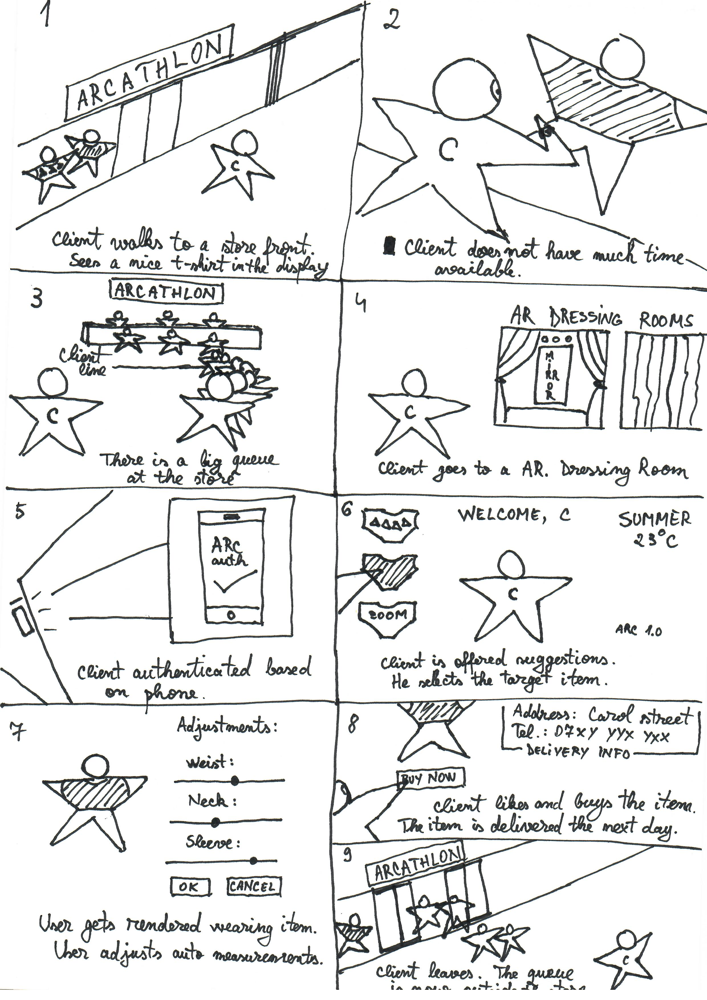

# ARC - Storyboards

### V1
The user enters a really big store that has what we call "lazy booths". In these booths, you can use a touchscreen to browse and select what items you wish to try on from the store. When an item is ordered, it is brought to the booth via an automated system.
The user tries on the merchandise, and then selects via the touchscreen what items he wishes to keep. While trying on various items, the user receives suggestions based on the items already ordered in the booth.
After leaving the booth, the user can pickup the selected merchandise at a checkout point, when exiting the store.

### V2 
The user visits an ARC enabled store. When he enters the store he is automatically authenticated based on his phone.
When the user goes past a specific part of the store, he receives suggestions on outfits or another similar items to his preferences on his phone via an app.
When the user goes into a booth, the items he will try on are scanned and the user further receives suggestions on his phone based on the items he is trying on.

### V3
The user visits an ARC enabled store. Because there's a line to checkout and because the user is in a hury, he goes into an Augmented Reality dressign room. When he enters the dressing room, he is automatically signed in based on an app on his phone.
The dressign room contains a human sized touchscreen that renders an image of the user wearing a specific item. Based on various suggestions, the user selects an item to try out and then gets rendered based on various estimations. The user can alter a few parameters for the item he is trying on if he thinks the rendered item will not fit properly at first.
He then orderes the item from the touchscreen and the item is delivered a few days later on his door step. 
